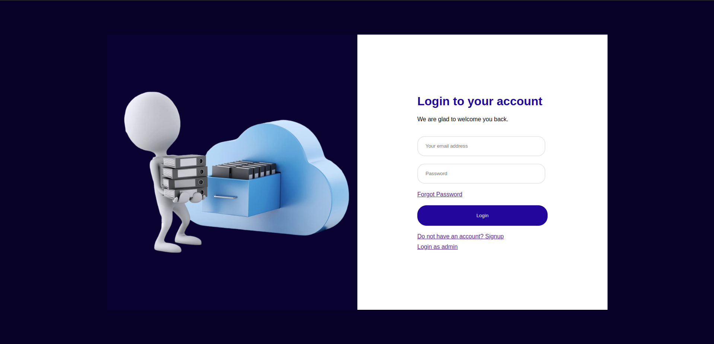
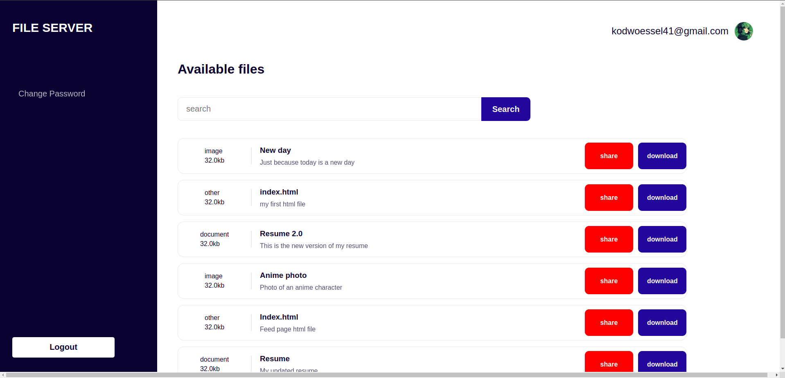

# FileServer Django Project README

## Project Overview

### Problem Description
Lizzy runs a business that distributes documents in the likes of wedding cards, admission forms, etc. on behalf of various businesses to different users. All have been moving well but she desires to scale her business. After doing research she find that having a digitail plaform where these can be easily assessed and downloaded remotely is a good solution to the scaling challenge she currently faces.

### Customer Requirements
Users should be able to:
1. Signup & Login using email and password with authnetication. There should be reset password feature to recover lost password.
2. See feed page that contains a list of files that can be downloaded.
3. Search the file server.
4. Send a file to an email through the platform.

### Admin
1. Should be able to upload files with title and description.
2. Should be able to see the number of downloads and the number of emails sent for each file.

FileServer is a Django-based web application designed for managing files within an organization. It provides features for users to download, and share files securely. The project is structured into three main apps:

1. **fileManager**: Responsible for managing files.
2. **userAuth**: Handles user authentication, registration, login, and password management.
3. **administration**: Provides administrative functionalities for managing files.

### Features

- **File Management**: Users can upload files, categorize them with titles and descriptions, and download files securely.
- **User Authentication**: Secure user authentication with email verification and password management functionalities.
- **Administration**: Admin panel for managing files, including file uploads and monitoring.
- **Search Functionality**: Users can search for files based on titles.
- **Email Integration**: Integration with email for account activation, password reset, and file sharing functionalities.

## Installation

To set up and run the project locally, follow these steps:

1. Clone the repository:
   ```
   git clone git@github.com:PyJim/fileServer.git (for SSH)
   or
   git clone https://github.com/PyJim/fileServer.git (for HTTPS)
   cd fileserver
   ```

2. Install dependencies:
   ```
   pip install -r requirements.txt
   ```

3. Run migrations:
   ```
   python manage.py migrate
   ```

4. Create a superuser:
   ```
   python manage.py createsuperuser
   ```

5. Run the development server:
   ```
   python manage.py runserver
   ```

6. Access the application:
   Open a web browser and go to `http://127.0.0.1:8000/`

## Apps Overview

### 1. fileManager
- **Purpose**: Manages file upload, download, and categorization functionalities.
- **Features**: 
  - Access available files.
  - Email file within the application
  - Download files securely.
  - Search files based on titles and descriptions.
- **URLs**: 
  - `feed/`: Display list of files.
  - `feed/download/<int:file_id>/`: Download a specific file.
  - `feed/email/<int:file_id>/`: Share a file via email.

### 2. userAuth
- **Purpose**: Handles user authentication and account management functionalities.
- **Features**: 
  - User registration with email verification.
  - Secure login and logout functionalities.
  - Password management including reset and change.
- **URLs**: 
  - `signup/`: User registration page.
  - `signin/`: User login page.
  - `logout/`: Logout functionality.
  - `activate_user/<uidb64>/<token>/`: used to activate user account.
  - `request_activation_email/`: used to request activation email.
  - `reset_password/`: used to reset password.
  - `forgot_password/`: used for resetting forgot password.
  - `reset_forgotten_password/<uidb64>/<token>/`: allows to enter new password having verified email.

### 3. administration
- **Purpose**: Provides administrative functionalities for managing users and files.
- **Features**: 
  - Admin panel for managing users and files.
  - File upload functionality restricted to staff users.
- **URLs**: 
  - `login/`: Admin login page.
  - `files/`: Admin panel to manage files (accessible to staff users).
  - `upload/`: File upload page (accessible to staff users).


## Configuration

- **Settings**: The project settings are located in `fileserver/settings.py`. Modify these settings as per your requirements.
- **Database**: By default, the project uses SQLite database. You can change it to any other supported database by modifying the `DATABASES` setting in `settings.py`.
- **Email Configuration**: Configure email settings in `settings.py` for email functionalities to work properly.
- **Static and Media files**: Static files are stored in `fileserver/static/` directory and media files (uploaded files) are stored in `fileserver/staticfiles/image/uploads/` directory.

## Deployment

- **Hosting**: The project has been hosted on render.
- **Database**: For production, postgresql database provided by render was used due to it's robustness.


### URL
The deployed version of the application can be found [here](https://fileserver-qnur.onrender.com)


## Testing

Unit tests have been written. run:

```
    python manage.py test

```
to run all the tests of the various endpoints.

## Administrator
For the sake of testing of the deployed version, the administrator login details are:

`Email`: admin@fileserver.com
`Password`: password

## Images of Interface

While this is purely a backend project, a basic frontend has been implemented to ease the process of testing. Here are images of some of the interfaces.





